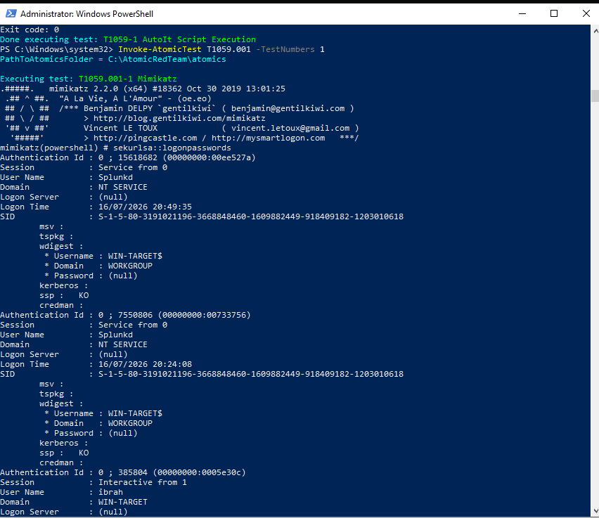
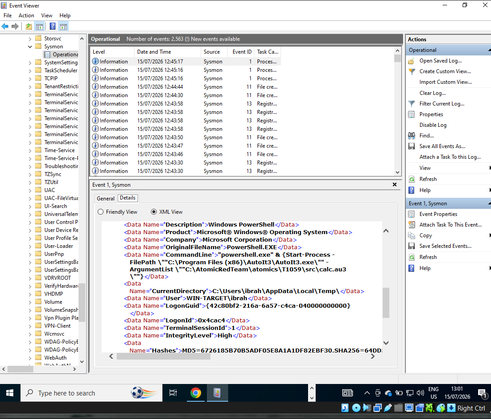
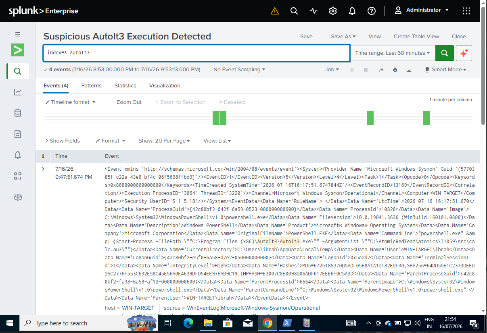
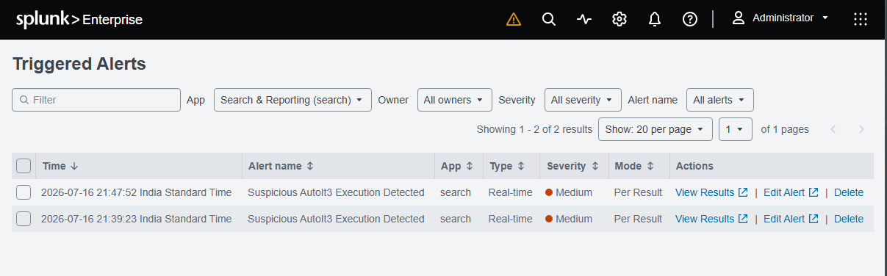

# 🛡️ Enterprise SOC Pipeline & Threat Hunting Lab

## 🎯 Objective
The purpose of this project was to build a fully operational Security Operations Center (SOC) pipeline to simulate, detect, and automatically alert on adversary behavior. This lab demonstrates the ability to ingest endpoint telemetry, write custom SIEM queries, and implement real-time automation.

## 🛠️ Tools & Infrastructure
* **Target Endpoint:** Windows 10 Virtual Machine
* **Telemetry Generation:** Microsoft Sysmon (System Monitor)
* **Adversary Simulation:** Atomic Red Team (MITRE ATT&CK Framework)
* **SIEM:** Splunk Enterprise

## 🚦 The Attack Lifecycle

### 1. Adversary Simulation (Execution)
Using Atomic Red Team, simulated malicious script execution (MITRE ATT&CK T1059) and credential dumping (T1059.001 / Mimikatz) via PowerShell. 

### 2. Endpoint Telemetry (Detection)
Configured Sysmon to capture detailed process creation events (Event ID 1). Even if a malicious script fails to fully execute, the initial command-line parameters are securely logged.

### 3. Log Ingestion & Threat Hunting (Analysis)
Forwarded the raw XML Windows Event Logs into Splunk. Developed custom Search Processing Language (SPL) queries to isolate the specific malicious `AutoIt3` and `PowerShell` execution paths among thousands of background processes.

### 4. Automated Alerting (Response)
Engineered a custom, real-time alert trigger inside Splunk to automatically notify the SOC whenever this specific T1059 behavior is detected in the future, effectively closing the loop from detection to automated response.

